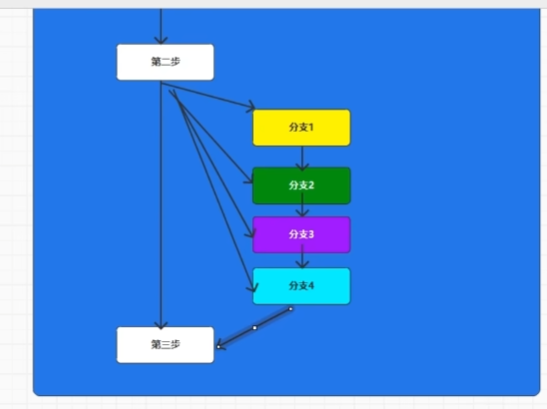

#  基础语法

```java
package chapter01;

public class java02_HelloJava {
    public static void main(String[] args) {
        System.out.println("Hello");
        System.out.println("Hello");
        System.out.println("Hello");
        System.out.println("Hello");
        System.out.println("Hello");
        //ctrl + D :复制当前行
        //ctrl + R 替换当前文字内容
    }
}

```

# 变量使用

```java
 package chapter02;

public class Java01_Variable {
    public static void main(String[] args) {
        // TODO 变量
        //所谓变量，其实就是可以改变向量存储
        //1.变量声明
        //  数据类型 变量名称
        String name;
        // 2.变量赋值
        //变量名称 = 数据
        name = "zhangsan";
        // 3.变量的使用
        //直接访问变量名称即可
        System.out.println(name);

        //将变量的声明赋值在一行代码中完成
        String username = "lisi";
        System.out.println(username);

        /*
            在变量使用前必须要要给变量赋值这个操作称为变量初始化
         */
//        String email;
//        email = "177QQ.com";
//        System.out.println(email);
    }
}

```

# 标识符和数据类型

```java
package chapter02;

public class Java02_Variable {
    public static void main(String[] args) {
        //TODO 标识符
        //表示数据的符号，称之为标识符
        //变量名就是标识符
        //标识符主要用于起名
        String name = "zhangsan";

        //TODO 标识符命名规则
        //1.英文拉丁字母
        //wx,qq
        String username = "zhansan";
        String xingming = "lisi";
        //2.符号
        //@,#,$,%
        //标识符只能采用下划线和美元$符号，其他符号不能使用,称之为特殊符号
        String _name = "wangwu";
        String $name = "leifeng";
        String $na_me = "liyuhang";
        System.out.println(_name);
        System.out.println($name);
        System.out.println($na_me);
        //3.数字
        //阿拉伯数字0~9可以作为标识符使用,但是不能开头
        //数组如果在标识符开头位置,那么就会呗识别为数字,不是标识符,所以会发生错误 String 1name = "name";
        String name1 = "zhangsan";
        //4.在大括号范围内,标识符不允许重复 String name;(前面有name)
        //标识符区分大小写的 String NAME = "zhangsan";
        //5. Java语言中预先定义好了一些标识符,称之为关键字,保留字 例:public static (可以大写)
        //可以使用大写来实现关键字名称的定义,但是不推荐容易造成歧义
        //6.驼峰标识:规范
        String userName = "zhangsan";
        //7.标识符的长度
        //没有长度的限制
    }
}

```

# 数据类型介绍

```Java
package chapter02;

/**
 * @program: java-top-speed
 * @author: Mr.Li
 * @create: 2023/1/5  22:52
 **/
public class Java03_Datatype_1 {
    public static void main(String[] args) {
        //TODO 1.整数类型
        //byte : 8位
        byte b = 10;
        //short : 16位
        short s = 10;
        //int : 32位
        int i =10;
        // long : 64位
        long lon = 10;

        //TODO 2.浮点数类型
        //默认情况下,小数点的数据会识别为精度较高的双精度double类型
        //float : 单精度浮点类型
        float f = 1.0F;
        //double : 双精度浮点类型
        double d = 1.0;

        //TODO 3.字符类型
        //其实就是用符号表示位子的内容
        char c = 'A';

        //TODO 4.布尔类型
        //取值只有true false 成立true 不能离false
        boolean bln = true;
    }
}

```

# 数据类型的转换

```Java
package chapter02;

/**
 * @program: java-top-speed
 * @author: Mr.Li
 * @create: 2023/1/5  22:52
 **/
public class Java03_Datatype_2 {
    public static void main(String[] args) {
        //TODO 数据类型转换
        String name = "zhangsan";
        int age = 30;

        name = "lisi";
        //name = age 不行

        //byte -> short -> int -> long -> float -> double
        byte b = 10;
        short s = b;
        int i = s;
        long lon = i;
        float f = lon;
        double d = f;
        //Java中范围小的数据可以转化位范围大的数据,但是范围大的数据不能转换为范围小的数据(可以强制)
        //强制转换用小括号,去掉多余的东西
        int i1 = (int)d;

    }
}

```

# 引用数据类型

```Java
package chapter02;

/**
 * @program: java-top-speed
 * @author: Mr.Li
 * @create: 2023/1/6  11:07
 **/
public class Java03_Datatype_3 {
    public static void main(String[] args) {
        //TODO 引用类型
        //所谓引用类型,其实就是可以被引用的数据类型
        String s = "abc";
        int i = 10;
    }
}

```

# Java中的运算符


## 二元与一元运算符

```Java
package chapter02;

/**
 * @program: java-top-speed
 * @author: Mr.Li
 * @create: 2023/1/6  11:10
 **/
public class Java04_Operator {
    public static void main(String[] args) {
        //TODO 运算符
        //所谓运算符,就是参与数据运算的符号,Java定义的,不是自己定义的

        //TODO 表达式
        //采用运算符和数据链接在一起形成符合Java语法规则的指令代码,称之为表达式

        //TODO 算数运算符
        //1.二元运算符:两个元素参与运算符 + - * / %
        //TODO 算数表达式 = 元素1 二元运算符 元素2
        //结果是元素类型最大的一种,最小用int类型
        //有优先级,可以加括号
        System.out.println(1+2);//3
        System.out.println(1/2);//0 (int int)==int
        System.out.println(1.0/2);//(double int)==double
        byte b1=10,b2=20;
        byte b3 = (byte)(b1 = b2);//需要强制类型转换 否则为int
        //2.一元运算符
        //++操作就是+1的简化版本,自增运算符
        //++i  i++ 先++和后++不一样
        //自减运算一样
        int i = 0;
        int j = i++;//j = 0;
        //i = i + 1;//i = 1;
        System.out.println("i = "+ i);//1
        System.out.println("j = " + j);//0
        System.out.println("i = " + ++i);//2
    }
}

```

## 赋值运算符

```Java
package chapter02;

/**
 * @program: java-top-speed
 * @author: Mr.Li
 * @create: 2023/1/6  11:54
 **/
public class Java04_Operator_1 {
    public static void main(String[] args) {
        //TODO 赋值运算符
        //=就是赋值运算符,将右边赋值给左边
        //赋值运算符需要考虑类型的关系
        String name = "zhangsan";
        byte b = 10;
        short s = b;

        //TODO 复合赋值运算符
        //如果元素进行运算后重新赋值给自己,就可以用复合赋值运算符
        //如果使用复合赋值运算符,那么数据类型不会发生变化
        int i = 1;
        //i = i+1
        i += 1;
        System.out.println(i);//2
        byte b1 = 10;
        b1 +=  20;
        System.out.println(b1);//30 b1还是byte类型
    }
}

```

## 关系运算符

```java
package chapter02;

/**
 * @program: java-top-speed
 * @author: Mr.Li
 * @create: 2023/1/6  12:55
 **/
public class Java04_Operator_2 {
    public static void main(String[] args) {
        //TODO 关系运算符
        //所谓的关系运算符就是比较两个数据元素之间关机的运算符
        //关系表达式 元素1(数据1 表达式1) 关系运算符(== != > < <= >=) 元素2(数据2 表达式2)
        //关系表达式结果是boolean类型 预想相同为true 预想不同为false
        /**
         * == 为相等
         * != 不相等
         * > < >= <= 大于 小于 大于等于 小于等于
         */
        int i =10;
        int j = 20;
        System.out.println(i > j);//false
    }
}

```

## 逻辑运算符

```java
package chapter02;

/**
 * @program: java-top-speed
 * @author: Mr.Li
 * @create: 2023/1/6  13:02
 **/
public class Java04_Operator_3 {
    public static void main(String[] args) {
        // TODO 逻辑运算符
        //所谓逻辑运算符 就是表示多个条件表达式之间的关系的运算符
        //TODO 基本语法结构
        //变量 = (条件表达式1) 逻辑运算符 (条件表达式2)
        //结果的变量类型为布尔类型
        //因为条件表达式的结果为boolean,所以逻辑运算表达式记得结果也是Boolean,但是分集中情况:
        //true true => ?
        //true false => ?

        //TODO 逻辑运算符: & :与
        //两个结果都是true才行,其他结果全为false
        int i = 10;
        boolean result = (i > 5) & (i < 20);//true & 必须两个都为true才行
        System.out.println(result);

        //TODO 螺距运算符: | :或
        //两个有一个为true就可以为true 只有两个都为false才为false
        int j = 10;
        boolean result1 = (i < 5) | (i < 20); //false | true ==> true
        System.out.println(result1);//true

        //TODO 逻辑运算符: && : 短路与运算符
        //根据第一个表达式运算结果判断是否执行第二个表达式
        //如果第一个表达式已经能够判断最终结果就不用判断下一个表达式
        int i1 = 10,j1 = 20;
        boolean result3 = (i > 10) && (++j > 30);
        System.out.println(result3);//false

        //TODO 逻辑运算符: || : 短路或运算符
        //第一个为true 不在检查第二个条件表达式
        //TODO 逻辑运算符: ! : 非(相反)运算
        //true => false
        //false => true
        int i2 = 10;
        boolean result4 = i2 == 10;
        boolean result5 = i2 > 10;
        System.out.println(!result4);//false
        System.out.println(!result5);//true

    }
}

```

## 三元运算符

```java
package chapter02;

/**
 * @program: java-top-speed
 * @author: Mr.Li
 * @create: 2023/1/6  16:42
 **/
public class Java04_Operator_4 {

    public static void main(String[] args) {

        //TODO 运算符 - 三元运算符
        //三个元素参与的运算符
        //基本语法结构
        //变量 = (条件表达式) ? (任意表达式1) :(任意表达式2)
        //运算规则:true执行表达式1,false执行表达式2
        int i = 10;
        int j = 20;
        int k = (i != 10) ? 1 + 1 : 2 + 2;//4
        System.out.println(k);
    }

}

```

# 流程控制

## 顺序执行

```java
package chapter03;

/**
 * @program: java-top-speed
 * @author: Mr.Li
 * @create: 2023/1/6  16:49
 **/
public class Java01_FlowControl {
    public static void main(String[] args) {
        //TODO 流程控制
        //计算机在执行代码时,对指令代码执行顺序的控制
        //java中的流程控制主要分为三种
        //1.顺序执行:代码出现的先后顺序及语法的先后顺序
        //2.分支执行
        //3.重复执行
    }
}

```

## 分支执行


**分支结构可以有很多种,三分支,四分支等等**统称为==多分支结构==

* 特殊结构



* 单分支

```Java
package chapter03;

/**
 * @program: java-top-speed
 * @author: Mr.Li
 * @create: 2023/1/6  16:55
 **/
public class Java02_FlowControl {
    public static void main(String[] args) {
        //TODO 流程控制-分支执行
        //分支结构
        //1.TODO可选分支:单分支结构
        System.out.println("第一步");
        System.out.println("第二步");
        //判断使用if语句
        int i = 10;
        if(i != 10)
        System.out.println("分支");//不会出现
        else
        System.out.println("第三步");


    }
}

```

* 双分支(下面)

```Java
package chapter03;

/**
 * @program: java-top-speed
 * @author: Mr.Li
 * @create: 2023/1/6  16:55
 **/
public class Java02_FlowControl {
    public static void main(String[] args) {
        //TODO 流程控制-分支执行
        //分支结构
        //1.TODO可选分支:单分支结构
        System.out.println("第一步");
        System.out.println("第二步");
        //判断使用if语句
        int i = 10;
        if(i != 10)
        System.out.println("分支");//不会出现
        else
        System.out.println("第三步");

        //TODO 必选分支,双分支结构(二选一)
        int i1 = 10;
        //出现分支2
        if( i == 20){
            System.out.println("分支1");
        } else {
            System.out.println("分支2");
        }
    }
}

```

* 多分支用if else if else...
* 特殊多分支switch case关键字

```Java
package chapter03;

/**
 * @program: java-top-speed
 * @author: Mr.Li
 * @create: 2023/1/6  18:45
 **/
public class Java03_FlowContral {
    public static void main(String[] args) {
        /**
         * TODO 流程控制 - 分支执行
         * switch (数据){}
         * switch会对数据进行判断,如果等于某一分支数据就会执行对应的逻辑代码
         * 如果分支都无法匹配,那么一个分支都不会执行,如果有需要可以加入default关键字
         * 如果执行某一分支后,不想执行其他分支,加入break关键字,跳出分支结构
         * 不足:只能做等值判断,不能做范围判断
         */
        System.out.println("第一步");
        System.out.println("第二步");
        int i = 40;
        switch(i){
            case 10:
                System.out.println("分支1");
                break;
            case 20:
                System.out.println("分支2");
                break;
            case 30:
                System.out.println("分支3");
                break;
            default :
                System.out.println("default");
        }
        System.out.println("第三步");
    }
}

```

## 小练习

```java 
package chapter03;

/**
 * @program: java-top-speed
 * @author: Mr.Li
 * @create: 2023/1/8  11:17
 **/
public class Java04_FlowControl_Test {
    public static void main(String[] args) {
        //TODO 流程控制 - 分支执行 - 小练习
        int age = 45;
        //儿童(0-6),少年(7-17),青年(18-40),中年(45-60),老年(60~)
        //if else if..
        //switch case case default ......
        if(age<0) System.out.println("输入年龄非法");
        else if(age < 7)
            System.out.println("儿童");
        else if(age<18)
            System.out.println("少年");
        else if(age<41)
            System.out.println("青年");
        else if(age<60)
            System.out.println("中年");
        else
            System.out.println("老年");

    }
}

```

## 循环 while do...while... for...循环语法

```java 
package chapter03;

/**
 * @program: java-top-speed
 * @author: Mr.Li
 * @create: 2023/1/8  11:27
 **/
public class Java05_FlowControl {
    public static void main(String[] args) {
        //TODO 流程控制 - 重复执行(循环执行)
        //根据条件重复执行某段代码
        //Java中主要有三种循环语法
        //1.while:有条件循环
        //while (条件表达式) {需要循环的代码}
        //基本执行原理:while循环会判断条件是否为true
        //false退出循环
        //true继续执行循环
        int age = 30;
//        while(age<40) System.out.println("循环代码");
        //2.do..while..循环
        //执行原理与while循环基本相同,区别在于循环代码是否事先执行一次
        /*
        基本语法结构
        do{
            循环代买
        }while(条件表达式)
         */
//        do{
//            System.out.println("新的循环代码");
//        }while(age<40);
        //3.for
        //如果条件表达式结果返回为false,那么跳过循环语句,直接执行后续代码,如果返回true,执行循环代码
        //循环代码执行后会重新进行表达式判断,如果结果为true,继续执行,为false不在执行
        /*
        for(初始化表达式;条件表达式;更新表达式){
            循环代码
        }
         */
        for(int i = 0;i<10;i++){
            System.out.println("for循环代码"+i);
        }
    }
}

```

## break continue关键字练习

```Java
package chapter03;

/**
 * @program: java-top-speed
 * @author: Mr.Li
 * @create: 2023/1/9  11:02
 **/
public class Java05_FlowControl_1 {
    public static void main(String[] args) {
        //TODO 流程控制 - 重复执行(循环执行)
        //break 跳出循环,不在执行循环操作
//        for(int i = 0;i<10;i++){
//            //切断 跳出循环
//            if(i == 4)  break;
//            else System.out.println(i);
//        }

        //continue 跳过当前循环,执行下一次循环
        for(int i = 0;i<10;i++){
            //切断 跳出循环
            if(i == 4)  continue;
            System.out.println(i);
        }
    }
}

```

## 小练习

```Java
package chapter03;

/**
 * @program: java-top-speed
 * @author: Mr.Li
 * @create: 2023/1/9  11:07
 **/
public class Java06_FlowControl_Test {
    public static void main(String[] args) {
        //TODO 流程控制 - 小练习
        //九层妖塔
        /*
               *
              ***
             ******
         */
//        for(int i=1;i<10;i++){
//            for(int j = i;j > 0;j--) System.out.print("*");
//            System.out.println();
//        }
//      for (int i = 0;i < 1;i++) System.out.println("*");
        for(int j = 0;j < 9;j++){
            for(int i = 0;i < 8 - j;i++){
                System.out.print(" ");
            }
            for (int i = 0;i < j * 2 + 1;i++){
                System.out.print("*");
            }
            System.out.println();
        }


    }
}

```

# 面向对象

```Java
package chapter04;

/**
 * @program: java-top-speed
 * @author: Mr.Li
 * @create: 2023/1/9  11:44
 **/
public class Java01_Object {
    public static void main(String[] args) {
        //TODO 面向对象
        //以问题所涉及到的事物为中心分析方式
        //类和对象
        //对象表示具体事物
        //TODO class(类)
        /*
        基本语法结果
        class 类名{
            特征(属性)
            功能(方法)
        }
         */
        //问题:做一道菜,红烧排骨
        //类:菜,对象:红烧排骨
        //TODO 1.先声明类
        //TODO 2.创建对象
        //TODO 声明类型: 变量类型 变量名称 = 变量值
        //TODO 4. 声明方法
        //          void 方法名 (参数) {功能代码}
        //TODO 5. 执行方法
        //          对象.方法名()
        Cooking cook = new Cooking();
        cook.name = "红烧排骨";
        cook.food = "排骨";
        System.out.println(cook.name);
        System.out.println(cook.food);
        System.out.println(cook.relish);
        System.out.println(cook.type);
        cook.execute();

        Cooking c = new Cooking();
        c.name = "红烧鱼";
        c.food = "鲤鱼";
        c.execute();

    }
}
class Cooking{
    //特征(属性)
    //名字
    String name;
    //菜的类型
    String type = "红烧";
    //食材
    String food;
    //佐料
    String relish = "大料";
    //执行方法
    void execute(){
        System.out.println("准备食材"+food);
        System.out.println("准备佐料"+relish);
        System.out.println("开始烹饪");
        System.out.println(name+"烹饪完成");

    }
}

```

## 案例分析

```java
package chapter04;

/**
 * @program: java-top-speed
 * @author: Mr.Li
 * @create: 2023/1/9  13:19
 **/
public class Java02_Object_2 {
    public static void main(String[] args) {
        Teacher t = new Teacher();
        t.name = "张三";
        Student s = new Student();
        s.name = "李四";
        t.teach();
        s.study();
    }
}
class Teacher{
    String name;
    void teach(){
        System.out.println(name+"老师在讲课");
    }
}
class Student{
    String name;
    void study(){
        System.out.println(name+"在听课");
    }
}
```

### 面向对象总结

```Java
package chapter04;

/**
 * @program: java-top-speed
 * @author: Mr.Li
 * @create: 2023/1/9  13:23
 **/
public class Java03_Object {
    public static void main(String[] args) {
        // TODO 面向对象
        /*
            基本语法
            声明
                class 类名{
                    属性(0个或多个)
                    类型 名称 = 值
                    方法(行为)
                    void 方法名(){
                        逻辑代码
                    }
                }
         */
        /**
         * 使用
         *      构建对象: new 类名();
         *      访问属性 : 对象.属性名
         *      访问方法 : 对象.方法名
         */
    }
}

```

```java
package chapter04;

/**
 * @program: java-top-speed
 * @author: Mr.Li
 * @create: 2023/1/9  13:27
 **/
public class Java04_Object_Class {
    public static void main(String[] args) {
        //TODO 面向对象
        //类:结构体,里面包含了属性和方法
        //  会有很多个对象
        //class : 关键字(都是小写)
        //类名:类的名称,标识符,遵循规则,一般情况下,类名首写字母为大写

        //对象:类的实例化(具象化)
        //new 类名();
        //new 也是关键字,创建具体对象,使用一次,创建一次,每次都是全新的
        //new 出来的对象,会赋值给变量,方便重复使用
        //变量的类型就是对象的类型
        //对象是将内存地址赋值给变量,所以变量其实是引用的内存中的对象,所以称之为引用变量
        //而变量的类型称之为引用类型
        User04 u= new User04();

        //特殊对象:空对象:没有引用的对象,称之为空对象,关键字对象
        //所有引用类型变量的取值就是null
        User04 u1 = null;

    }
}
class User04{

}
```

## 面向对象 -- 属性

```Java
package chapter04;

/**
 * @program: java-top-speed
 * @author: Mr.Li
 * @create: 2023/1/10  10:04
 **/
public class Java05_Object_Field {
    public static void main(String[] args) {
        //TODO 面向对象
        /**
         * 所谓属性,就是类对象的共同特征
         * 语法和变量的声明很像
         * 属性类型 属性名称 = 属性值
         * 如果声明属性的同时进行了初始化赋值,那么所有对象的属性就完全相同
         * 如果希望每个对象的属性不一致,不进行初始化
         * 那么属性会在构造对象时默认初始化,而默认初始化的值取决于属性的类型
         * byte short int long ==> 0
         * float double ==> 0.0
         * boolean ==> false
         * char ==> 空字符
         * 引用数据类型 ==> null
         * 变量的作用域非常小,只有当前的大括号内有效
         * 属性不仅仅在当前的类有效,而且可以随着对象在其他地方使用
         * 变量使用前必须初始化,否则会出现错误,属性可以不用初始化,因为JVM会自动初始化
         */
    }
}
class User05{
    //String name = "zhangsan";
    String name;
}
```

## 面向对象 -- 方法

```Java
package chapter04;

/**
 * @program: java-top-speed
 * @author: Mr.Li
 * @create: 2023/1/10  10:12
 **/
public class Java06_Object_Method {
    public static void main(String[] args) {
        //TODO 面向对象 - 方法
        //声明的语法:void 方法名(){ 逻辑代码 }
        //声明的语法(补充):方法返回值类型 方法名(){ 逻辑代码 return 返回值 }
        //这里的void就是没有任何结果
        /**
         * 方法调用方式 对象.方法名()
         *
         * 使用用户的账号密码进行登录
         * 名词: 用户 账号 密码
         * 动词: 登录
         */
        User06 u = new User06();
        boolean registerResult = u.register();
        if(registerResult){
            System.out.println("注册成功");
        }else {
            System.out.println("注册失败");
        }
        boolean loginResult = u.login();
        if(loginResult) System.out.println("登录成功");
        else System.out.println("登录失败");
    }
}
class User06{
    String account;
    String password;

    boolean register(){
        System.out.println("用户注册");
        return true;
    }
    boolean login(){
        System.out.println("用户登录");
        return true;
    }
}

```

## 方法参数

```java
package chapter04;

/**
 * @program: java-top-speed
 * @author: Mr.Li
 * @create: 2023/1/10  10:59
 **/
public class Java07_Object_Method_Param {
    public static void main(String[] args) {
        /**
         * TODO 面向对象 - 方法
         * 外部数据控制方法内部实现的操作,使用的是参数语法实现,也叫方法参数
         * 语法 : 方法名( 参数类型 参数名称)
         * 语法 : 方法名( 参数类型 参数名称,参数类型 参数名称)   可以放置多个参数
         */
        User07 user = new User07();
        String name = "张三";
        //传递参数
        user.sayHello(name,18);
        //方法传递多个参数时,需要注意
        /**
         * 1.参数的个数需要匹配
         * 2.参数的类型需要匹配
         * 3.参数的顺序需要匹配
         *
         * 4.当参数的个数不确定,但是类型相同,可以采取特殊的参数依法声明,可变参数
         *      如果参数中还包含其他含义的参数,那么可变参数应该声明在最后
         * 语法: 参数类型...参数名称
         * 一个都不传也可以,传很多也可以
         */
        user.test(30,"张三","李磊");
    }
}
class User07{
    void sayHello(String name,int age){
        System.out.println("Hello" + name+","+age);
    }
    void test(int age,String... name){
        System.out.println(name);
    }
}

```

## 方法参数 - 传值方式

```Java
package chapter04;

/**
 * @program: java-top-speed
 * @author: Mr.Li
 * @create: 2023/1/10  12:52
 **/

/**
 * 指针的问题,相当于复制,没有改变原来的值
 * 全局变量 局部变量
 */
public class Java_Object_Method_Param_1 {
    public static void main(String[] args) {
        //TODO 面向对象 - 方法 - 参数
        //Java中值的传递是值的传递
        int i = 10;
        test(i);
        System.out.println(i);//10
        String s = "abc";
        test1(s);
        System.out.println(s);//abc
        User user = new User();
        user.name = "zhangsan";
        test2(user);
        System.out.println(user.name);//李磊

    }
    public static void test(int i){
        i = i + 10;
    }
    public static void test1(String s){
        s = s + 10;
    }
    public static void test2(User user){
        user.name = "李磊";
    }
}
class User{
    String name;
}

```

## 面向对象 - 静态

```Java
package chapter04;

/**
 * @program: java-top-speed
 * @author: Mr.Li
 * @create: 2023/1/10  15:18
 **/
public class Java08_Object_Static {
    public static void main(String[] args) {
        //TODO 面向对象
        //针对具体对象的属性称之为对象属性,成员属性,实例属性(方法同理)

        //把和对象无关,与类相关的称之为静态
        //和类相关的属性称之为静态属性
        //和类相关的方法称之为静态方法
        //静态语法就是在属性和方法前加static
        Chinese c = new Chinese();
        c.name = "张三";
        System.out.println("Hello"+c.name+","+c.nationality);

        Bird.fly();//静态方法
        System.out.println(Bird.type);
    }
}
class Bird{
    static String type = "鸟";
    static void fly(){
        System.out.println("飞...");
    }
}
class Chinese{
    String name;
    //国籍
    String nationality = "China";
}
```

## 面向对象 - 静态代码块

```Java
package chapter04;

/**
 * @program: java-top-speed
 * @author: Mr.Li
 * @create: 2023/1/16  15:50
 **/
public class Java08_Object_Static_2 {
    public static void main(String[] args) {
        //TODO 面向对象 - 静态
        /**
         * 类的信息被自动加载完成后,会自动调用静态代码块,可以完成静态属性的初始化功能
         * 对象准备创建时,也会自动调用代码块,但不是静态的
         */
        //User08 u = new User08();
        //User08.test();//加载静态代码块
        new User08();//加载代码块
    }
}
class User08{
    static {
        //静态代码块
        System.out.println("静态代码块");
    }
    static {
        System.out.println("静态代码块1");
    }
    {
        //代码块
        System.out.println("代码块1");
    }
    {
        System.out.println("代码块2");
    }
    static void test(){
        System.out.println("test...");
    }
}
```

## 面向对象 - 包

```Java
package chapter04;

/**
 * @program: java-top-speed
 * @author: Mr.Li
 * @create: 2023/1/16  15:58
 **/
public class Java09_Object_Package {
    //TODO 面向对象 - package - 包

    /**
     * package 中容纳类
     * 基本语法 package 包的完整路径
     * 路径中的多个包是哦也能够点隔开
     * java.lang.Object
     * 主要功能用于分类管理
     *
     * 一个类可以没有包,但是package不可以在同一个源码文件中使用多次
     * 包名为了区分类名,所以一般全部都是小写
     * java.lang.Object
     */
    public static void main(String[] args) {
        //java中从在不同包但名称相同的类,可以使用包进行区分
        //一般情况下,在使用类的情况,我们都会使用类的全名(包名+类型)
        new java.util.Date();

    }
}

```

## 面向对象 - import

```java
package chapter04;
import java.util.*;
/**
 * @program: java-top-speed
 * @author: Mr.Li
 * @create: 2023/1/16  16:15
 **/
public class Java10_Object_Import {
    public static void main(String[] args) {
        //TODO 面向对象 - import
        //chapter04.Java10_Object_Import
        //import主要用于在使用类前准备好了
        //import语句只能使用package后,class前
        //import关键字可以多次使用,导入多个类
        //如果同一个包中需要导入多个类,那么可以使用通配符加型号来简化操作
        //如果import不同包但是重名的类,那么还是需要在使用前增加包名
        java.lang.String name = "张三";
        String name1 = "李四";

        new chapter04.Java10_Object_Import();
        new Java10_Object_Import();
        //上面两者都是相同的
        Date date = new Date();
        new ArrayList<>();
    }
}

```

## 面向对象构造方法

```Java
package chapter04;

/**
 * @program: java-top-speed
 * @author: Mr.Li
 * @create: 2023/2/10  18:10
 **/
public class Java11_Object_Instance {
    //TODO 面向对象 - 构建对象
    //构造方法:专门用于构建对象
    //如果一个类中没有任何构造方法,那么JVM会自动给你添加一个公共的,无参的构造方法,方便对象来调用
    //TODO 基本语法:类名(){}
    // 1.构造方法也是方法,但是没有void关键字
    // 2.方法名和类名完全相同
    // 3.如果类中没有构造方法,那么JVM会提供默认的构造方法
    // 4.如果类中有构造方法,那么JVM不会提供默认的构造方法
    // 5.构造方法也是方法,也能传递参数,但是一般传递参数的目的用于对象属性的赋值
    public static void main(String[] args) {
        System.out.println("before");
        User11 user11 = new User11("lisi");//user...
        System.out.println("after");
        user11.test();
        System.out.println(user11.username);
        //代码块是在构造之前就生成的
    }
}

class User11{
    String username;
    User11(String name){
        System.out.println("user...");
        username = name;
        System.out.println(username);
    }
    void test(){
        System.out.println("test...");
    }
    {
        System.out.println("代码块1");
    }
    {
        System.out.println("代码块2");
    }{
        System.out.println("代码块3");
    }
}
```

## 面向对象 - 继承

```Java
package chapter04;

import java.sql.SQLOutput;

/**
 * @program: java-top-speed
 * @author: Mr.Li
 * @create: 2023/2/10  18:39
 **/
public class Java12_Object_Extend {
    public static void main(String[] args) {
        //TODO 面向对象 - Extend - 继承
        //面向对象中有三个特别重要的概念:继承,封装,多态
        //类存在父子关系,子类可以直接获取到父类的成员属性和成员方法
        //类的继承只能是单继承,一个类只能有一个父类,不能有多个父类
        //一个类可以有多个子类
        Child c = new Child();
        System.out.println(c.name);
        c.test();

    }
}
class Parent{
    String name = "张三";
    void test(){
        System.out.println("test");
    }
}
class Child extends Parent{
}
```

### 面向对象 继承 super和this的调用

```Java
package chapter04;

import java.util.zip.DeflaterOutputStream;

/**
 * @program: java-top-speed
 * @author: Mr.Li
 * @create: 2023/2/10  18:50
 **/
public class Java12_Object_Extends_1 {
    //TODO 面向对象 - Extends - 继承
    //如果父类和子类有相同的属性,那么可以采用特殊的关键字进行区分
    //super this
    public static void main(String[] args) {
        Child1 c = new Child1();
        c.test();
    }
}
class Parent1{
    String name = "张三";
}
class Child1 extends Parent1{
    String name = "李四";
    void test(){
        System.out.println(super.name);
        System.out.println(this.name);
    }
}
```

### 面向对象 - 继承 - 构造方法 - 子类父类

```Java
package chapter04;

import java.time.chrono.ChronoLocalDate;

/**
 * @program: java-top-speed
 * @author: Mr.Li
 * @create: 2023/2/10  18:58
 **/
public class Java12_Object_Extends_2 {
    public static void main(String[] args) {
        //TODO 面向对象 - Extends - 继承
        //构造方法
        //父类对象是在子类对象创建前完成的,创建子类对象前会调用父类对象构造方法完成父类的创建
        //默认情况下,子类对象构建时,会默认调用父类的构造方法完成父类对象的创建,使用的是super关键字的方法,由JVM自动完成
        //如果父类提供构造方法,那么JVM不会提供构造方法,那么子类应该用super方法构建父类对象
        Child2 c = new Child2();
        Child2 c2 = new Child2();
        Child2 c3 = new Child2();
        //new:构建一个对象
        //父类不是有一个真正的对象存在
    }
}
class Parent2{
    String username;
    Parent2(String name){
        username = name;
        System.out.println("parent...");
    }
}
class Child2 extends Parent2{
    Child2(){
        super("zhangsan");
        System.out.println("child...");
    }
}
```

## 面向对象 - 多态 

* ==超人的力量不能展现出来==

```Java
package chapter04;

/**
 * @program: java-top-speed
 * @author: Mr.Li
 * @create: 2023/2/10  20:17
 **/
public class Java13_Object {
    public static void main(String[] args) {
        //TODO 面向对象 - 多态
        //所谓的多态,其实就是一个对象在不同情境下表现出来的不同状态和形态
        //多态语法其实就是队对象的使用场景进行约束
        //超人的超能力不能展现出来
        //一个对象可以使用的功能取决于引用变量的类型
        Person p = new Person();
        p.test();
        Person p1 = new Boy();
        //p1.testBoy();
        Person p2 = new Girl();
        //p2.testGirl();
        Boy b = new Boy();
        b.testBoy();
        Girl g = new Girl();
        g.testGirl();
    }
}
class Person{
    void test(){
        System.out.println("test Person");
    }
}
class Boy extends Person{
    void testBoy(){
        System.out.println("test Boy");
    }
}
class Girl extends Person{
    void testGirl(){
        System.out.println("test Girl");
    }
}
```

## 面向对象 - 方法的重载

```Java
package chapter04;

/**
 * @program: java-top-speed
 * @author: Mr.Li
 * @create: 2023/2/11  13:03
 **/
public class Java14_Object {
    public static void main(String[] args) {
        //TODO 面向对象
        //一个类中不能声明相同的方法,也不能声明相同的属性
        //这里相同的方法,只得是方法名和参数列表相同,和返回值类型无关
        //如果方法名相同,参数列表不同(个数,顺序,类型)不相同,会认为是不同的方法,只不过名称一样
        //这个操作在Java中成为方法的重载
        //构造方法也存在方法重载
        User14 u = new User14();
        new User14("李梅");
        u.login(1111);
        u.login("123");
        u.login("123","123");
    }
}
class User14{
    User14(){
        System.out.println("user...");
    }
    User14(String name){
        System.out.println("user..."+name);
    }
    void login(String account,String password){
        System.out.println("账号,密码登录");
    }
    void login(int tel){
        System.out.println("手机验证码登录");
    }
    void login(String wx){
        System.out.println("微信,支付宝登录");
    }
}
```

```Java
package chapter04;

/**
 * @program: java-top-speed
 * @author: Mr.Li
 * @create: 2023/2/11  13:19
 **/
public class Java14_Object_1 {
    public static void main(String[] args) {
        //TODO 面向对象
        //如果在一个构造方法中想到调用其他的构造方法,需要使用关键字this
        User141 u = new User141();//一层层调用
//      User141 u1 = new User141("张三");
//      User141 u2 = new User141("张三","男");
    }
}
class User141{
    User141(){
        this("张三");
    }
    User141(String name){
        this("李梅","男");
    }
    User141(String name,String sex){
        System.out.println(name+","+sex);
    }
}
```

```Java
package chapter04;

/**
 * @program: java-top-speed
 * @author: Mr.Li
 * @create: 2023/2/11  13:24
 **/
public class Java14_Object_2 {
    public static void main(String[] args) {
        //TODO 面向对象
        byte b = 10;
        test(b);//如果注掉bbb,则输出的是sss
        int i = 10;
        test(i);
        //基本数据类型在匹配方法时,可以在数值不变的情况下,扩大数据精度
        //byte和char无法类型转换,char没有负数,但是byte存在负数
    }
//    static void test(byte b){
//        System.out.println("bbb");
//    }
    static void test(short s){
        System.out.println("sss");
    }
    static void test(char c){
        System.out.println("ccc");
    }
    static void test(int i){
        System.out.println("iii");
    }
}

```

```Java
package chapter04;

import com.sun.tools.javac.Main;

/**
 * @program: java-top-speed
 * @author: Mr.Li
 * @create: 2023/2/11  13:32
 **/
public class Java14_Object_3 {
    public static void main(String[] args) {
        //TODO 面向对象
        AAA a = new AAA();
        test(a);
        AAA aa = new BBB();
        test(aa);//多态 - 超人的力量发挥不出来
        BBB b = new BBB();
        test(b);
        //多态其实就是约束了对象的使用场景
        //方法的重载:方法名相同,参数列表不同(个数,顺序,类型)
        //AAA->Object(父类)
        BBB bb = new BBB();
        test(bb);//找父类
    }
    static void test(AAA aaa){
        System.out.println("aaa");
    }
//    static void test(BBB bbb){
//        System.out.println("bbb");
//    }
}
class AAA{

}
class BBB extends AAA{

}
```

## 面向对象 - 方法的重写

```Java
package chapter04;

/**
 * @program: java-top-speed
 * @author: Mr.Li
 * @create: 2023/2/11  13:42
 **/
public class Java15_Object {
    public static void main(String[] args) {
        //TODO 面向对象 - 重写
        //方法的重写:父类对象的方法,主要体现的是通用性,无法在特殊的场景下使用
        //          如果子类对象需要在特殊场合下使用需要重写方法的逻辑,这个操作在Java中称之为方法的重写
        //并不意味者父类的方法被覆盖,只是在当前场合不适用,如果使用super关键字还是可以访问
        //方法重写的要求,子类的方法和父类的方法,方法名相同,返回值类型相同,参数列表要相同
        Child15 c = new Child15();
        c.test();
    }
}
class Parent15{
    String name = "张三";
    void test(){
        System.out.println("Parent test");
    }
}
class Child15 extends Parent15{
    String name = "李四";
    void test(){
        System.out.println(this.name);
        System.out.println(super.name);
        super.test();
        System.out.println("Child test");
    }
}
```

```java
package chapter04;

import javax.print.attribute.standard.ReferenceUriSchemesSupported;

/**
 * @program: java-top-speed
 * @author: Mr.Li
 * @create: 2023/2/11  13:59
 **/
public class Java15_Object_1 {
    public static void main(String[] args) {
        //TODO 棉线对象 - 重写
        CCC c = new DDD();
        System.out.println(c.sum());
        //System.out.println(c.test);
        //一个对象能使用什么属性,取决于引用变量的类型
        //一个对象能使用什么方法,取决于引用变量的类型
        //一个对象的方法具体使用(直接,间接)是需要看具体的对象
        //一个对象的属性具体的使用是不需要看具体的对象的,属性在哪里声明,就在哪里使用
        //前部提供能调用的方法,后部能提供具体的方法实现
        DDD d = new DDD();
        System.out.println(d.sum());
    }
}
class CCC{
    int i = 10;
    int sum(){
        return getI() + 10;
    }
    int getI(){
        return i;
    }
}
class DDD extends CCC{
    int i = 20;
//    int sum(){
//        return i + 20;
//    }
    void test(){
        System.out.println("test");
    }
    int getI(){
        return i;
    }
}
```

## 面向对象 - 递归

```Java
package chapter04;

import java.util.concurrent.locks.ReentrantReadWriteLock;

/**
 * @program: java-top-speed
 * @author: Mr.Li
 * @create: 2023/2/11  22:05
 **/
public class Java16_Object_Recursion {
    public static void main(String[] args) {
        //TODO 面向对象 - 递归
        //递归:方法调用自己,称之为递归方法
        // 1 + 3 + 5...20以内奇数求和
        //System.out.println(num(10));
        System.out.println(computeAP(10));
        System.out.println(computerFactorial(5));

        //1.递归方法应该有跳出的程序
        //2.调用自身时,传递的参数需要有规律
    }
    //自己的方法
//    public static int num(int a){
//        int b,c,d;
//        if(a<0){
//            return 0;
//        }
//        if(a%2==0&&a>0){
//             b = a - 1;
//            c = b - 2;
//             d = num(c);
//        }else {
//            b = a;
//            c = b - 2;
//           d = num(c);
//        }
//
//        return d+b;
//    }
    //老师的方法,老师的方法是真的简单
    //等差数列
    public static int computeAP(int num){
        num = num % 2 == 0 ? num - 1: num;
        if(num == 1){
            return 1;
        }else {
            return num + computeAP(num - 2);
        }
    }
    //阶乘
    public static int computerFactorial(int num){
        if(num>1){
            return num * computerFactorial(num - 1);
        }else{
            return 1;
        }
    }
}

```

## 面向对象 - 访问权限

```Java
package chapter04;

import java.sql.SQLOutput;

/**
 * @program: java-top-speed
 * @author: Mr.Li
 * @create: 2023/2/11  22:39
 **/
public class Java17_Object_Access {
    public static void main(String[] args) {
        //TODO 面向对象 - 访问权限
        //public:公共的,访问权限修饰符
        //Java的源码中,公共类只能有一个,而且必须是和源码文件名相同
        //main方法:main方法是由JVM调用的,JVM调用时应该可以任意调用,也不用考虑权限问题

        //TODO Java中的访问权限主要分为四种
        // 1.private : 私有的 同一个类中可以使用
        // 2.(default) : 默认权限 当不设定任何权限时,JVM会默认提供权限,包(路径权限)权限,同一个包可以任意调用
        // 3.protected : 受保护的权限,子类可以访问
        // 4.public : 公共的 任意使用
        User17 u = new User17();
        //System.out.println(u.name);
    }
    static void test(){

    }
}
class User17{
    public String name;
    protected int age ;
}
class Child17 extends User17{
    protected void test(){
        System.out.println(age);
    }
}
```

* 小练习

```Java
package chapter04;

/**
 * @program: java-top-speed
 * @author: Mr.Li
 * @create: 2023/2/12  11:47
 **/
public class Java17_Object_Access_1 {
    public static void main(String[] args) {
        //TODO 面向对象 - 访问权限
        Person17 p = new Person17();
        //private : 同类
        //default : 同类,同包(路径)
        //protected : 同类,同包,子类
        //public : 公共的
        //所谓的访问权限,其实就是访问属性,方法的权力和限制
        //谁访问?Java17_Object_Access_1
        //访问谁?Person17 -> super -> java.lang.Object
        //p.clone();
    }
}
class Person17{
    void test() throws Exception{
        clone();
    }
}
```

## 面向对象 - 内部类和外部类

```Java
package chapter04;

/**
 * @program: java-top-speed
 * @author: Mr.Li
 * @create: 2023/2/12  11:55
 **/
public class Java18_Object {
    public static void main(String[] args) {
        //TODO 面向对象 - 外部类 - 内部类
        //Java中不允许外部类使用private,protected修饰
        //所谓的外部类:就是在源码中直接声明的类

        //内部类就当成外部类的属性即可

        //因为内部类可以看作外部类的属性,所以需要构建外部类对象才能使用
        OuterClass o = new OuterClass();
        OuterClass.InnerClass innerClass = o.new InnerClass();
    }
    private class InnerClass{

    }

    protected class InnerClass1 {

    }
}
class OuterClass{
    public class InnerClass{

    }
}
```

## 面向对象 - 单例模式

```Java
package chapter04;

/**
 * @program: java-top-speed
 * @author: Mr.Li
 * @create: 2023/2/12  12:02
 **/
public class Java19_Object {
    public static void main(String[] args) {
        //TODO 面向对象 - 单例模式
        //JVM默认给类提供的构造方法,其实就是公共的,无参的构造方法
        //1.类创建过程复杂
        //2.类的对象消耗资源
        //User19 u = new User19();
        User19 instance = User19.getInstance();
        User19 instance1 = User19.getInstance();
        System.out.println(instance1.equals(instance));
    }
}
class User19{
    private static User19 user19 = null;
    private User19(){

    }
    public static User19 getInstance(){
        if (user19 == null){
            user19 = new User19();
        }
        return user19;
    }
}
```

## 面向对象 - final关键字

```Java
package chapter04;

/**
 * @program: java-top-speed
 * @author: Mr.Li
 * @create: 2023/2/12  12:22
 **/
public class Java20_Object {
    public static void main(String[] args) {
        //TODO 面向对象
        //Java中提供了一种语法,可以在数据初始化后不被修改,使用关键字final
        //final可以修饰属性,那么JVM无法自动进行初始化,需要自己进行初始化,属性值不能发生变化
        //一般将final修饰的变量称之为常量,或者叫做不可变量
        //final可以修饰方法,这个方法不能被子类重写
        //final可以修饰类,用final修饰的类不能有子类
        //final不可以修饰构造方法
        //final可以修饰方法的参数的,一旦修饰,参数就无法修改
        String name = "张三";

        System.out.println(name);
        User20 u  = new User20("辛弃疾");
        //u.name = "lisi";
        System.out.println(u.name);
        //u.name = "zhangsan";
       // System.out.println(u.name);
    }
}
final class User20{
    public final String name;
    String name1;
    User20 (String name){
        this.name = name;
    }
    public final void test(){

    }
}
//class Child20 extends User20{
//    public void test(){
//
//    }
//}
//class Child20 extends User20{
//
//}
```

## 面向对象 - 抽象

```Java
package chapter04;

/**
 * @program: java-top-speed
 * @author: Mr.Li
 * @create: 2023/2/12  13:09
 **/
public class Java21_Object_Abstract {
    //TODO 面向对象 - 抽象 - Abstract
    //抽象类: 不完整的类,就是抽象类
            //abstract class 类名
    //因为类不完整,所以类不能构建对象
    //如果一个类中含有抽象方法,这个类是抽象类
    //如果一个类是抽象类,它的方法不一定是抽象方法

    //抽象方法: 只有声明,而没有实现的方法是抽象方法
                //abstract 返回值类型 方法名(参数)
    //如果抽象类中含有抽象方法,那么子类继承时需要重新写抽象方法,将方法补全

    //abstract关键字不能和final关键字同时使用
    //分析问题:对象(具体) ==> 类(抽象)
    //编写代码:类(抽象) == 对象(具体)
    public static void main(String[] args) {
        Chinese21 c = new Chinese21();
        c.eat();
    }

}
abstract class Person21{
    public abstract void eat();
    public void test(){

    }
}
class Chinese21 extends Person21{
    @Override
    public void eat() {
        System.out.println("中国人用筷子吃饭");
    }
}
```

## 面向对象 - 接口

```Java
package chapter04;

/**
 * @program: java-top-speed
 * @author: Mr.Li
 * @create: 2023/2/12  16:39
 **/
public class Java22_Object {
    public static void main(String[] args) {
        //TODO 面向对象 - 接口
        //所谓的接口,可以简单理解为规则
        //基本语法 : interface 接口名称 { 规则属性 , 规则行为 }
        //接口实际上是抽象的
        //规则的属性必定为固定值,并且不能被修改
        //属性和行为的访问权限必须为公开的
        //属性应该是静态的
        //行为是抽象的
        //接口和类是两个层面上的东西
        //接口可以继承其他接口
        //类的对象需要遵循接口,在Java中,这个遵循,称之为实现(implements),类需要实现接口,而且可以实现多个接口
        Computer computer = new Computer();
        Light light = new Light();
        computer.usb1 = light;
        Light light1 = new Light();
        computer.usb2 = light1;
        computer.powerSupply();
        light1.test();
        //computer.powerSupply();
    }
}
interface USBInterface{

}
interface USBSupply{
    public void powerSupply();
}
interface USBReceive{
    public void powerReceive();
}
class Computer implements USBSupply{
    public USBReceive usb1;
    public USBReceive usb2;
    @Override
    public void powerSupply() {
        System.out.println("电脑提供电源");
        usb1.powerReceive();
        usb2.powerReceive();
    }
}
class Light implements USBReceive{
    @Override
    public void powerReceive() {
        System.out.println("电灯接受电源");
    }
    public void test(){
        System.out.println("test");
    }
}
```

## 面向对象 - 枚举类

```Java
package chapter04;

import java.util.concurrent.CountDownLatch;

/**
 * @program: java-top-speed
 * @author: Mr.Li
 * @create: 2023/2/12  18:57
 **/
public class Java23_Object_Enum {
    public static void main(String[] args) {
        //TODO 面向对象 - 枚举
        //枚举是一种特殊的类,其中包含了一组特定的对象,这些对象不会发生改变,一般都使用大写的标识符
        //枚举使用enum关键字使用
        //枚举类会将对象放置在最前面,那么后面的语法需要使用分号隔开
        //枚举类不能创建对象,它的对象是在内自行形成的
        System.out.println(City.BEJING.name);
        System.out.println(City.SHANGHAI.code);
        System.out.println(MyCity.BEIJING.code);
    }
}
enum City{
    BEJING("北京",1001),SHANGHAI("上海",1002);
    public String name;
    public int code;
    City(String name,int code){
        this.name = name;
        this.code = code;
    }
}
class MyCity{
    public String name;
    public int code;
    private MyCity(String name , int code){
        this.name = name;
        this.code = code;
    }
    public static final MyCity BEIJING = new MyCity("北京",1001);
    public static final MyCity SHANGHAI = new MyCity("上海",1002);
}
```

## 面向对象 - 匿名类

```Java
package chapter04;

/**
 * @program: java-top-speed
 * @author: Mr.Li
 * @create: 2023/2/12  19:09
 **/
public class Java24_Object {
    public static void main(String[] args) {
        //TODO 面向对象
        //在某些场合下,类的名字不重要,我们只想使用类中的方法或功能,那么此时我们可以采用特殊的语法:匿名类
        //所谓的匿名类就是没有名称的类
        Me me = new Me();
        me.sayHello(new zhangsan());
        me.sayHello(new lisi());
        me.sayHello(new Person24() {
            @Override
            public String name() {
                return "wangwu";
            }
        });
        me.sayHello(new Person24() {
            @Override
            public String name() {
                return "zhaoliu";
            }
        });
        new Bird24().fly();
        new Fly(){
            @Override
            public void fly() {
                System.out.println("使用飞行器飞行");
            }
        }.fly();
    }
}
abstract class Person24{
    public abstract String name();
}
class Me{
    public void sayHello(Person24 person24){
        System.out.println("Hello "+person24.name());
    }
}
class zhangsan extends Person24{
    @Override
    public String name() {
        return "zhangsan";
    }
}
class lisi extends Person24{
    @Override
    public String name() {
        return "lisi";
    }
}
interface Fly{
    public void fly();
}
class Bird24 implements Fly{
    @Override
    public void fly() {
        System.out.println("使用翅膀");
    }
}
```

## 面向对象 - Bean类

```Java
package chapter04;

import java.rmi.server.UID;

/**
 * @program: java-top-speed
 * @author: Mr.Li
 * @create: 2023/2/12  20:07
 **/
public class Java25_Object {
    public static void main(String[] args) {
        //TODO 面向对象
        // 1.主要用于编写逻辑
        // 2.主要用于简历数据模型(Bean)
        //TODO Bean类的设计规范 : Bean规范
        // 1.类要求必须含有无参,公共的构造方法
        // 2.属性必须私有化,然后提供公共的set get方法
        User25 user25 = new User25();
        //user25.account = "123456";
        //user25.password = "123456";
        user25.setAccount("123456");
        user25.setPassword("123456");
        System.out.println(login(user25));

    }
    public static boolean login(User25 user25){
        if (user25.getAccount().equals("123456")&&user25.getPassword().equals("123456"))
            return true;
        else return false;
    }
}
class User25{
    private String account;
    private String password;
    public void setAccount(String account){
        this.account = account;
    }
    public void setPassword (String password){
        this.password = password;
    }
    public String getAccount(){
        return account;
    }
    public String getPassword(){
        return password;
    }
}
```

## 面向对象 - 作用域

```Java
package chapter04;

/**
 * @program: java-top-speed
 * @author: Mr.Li
 * @create: 2023/2/12  20:52
 **/
public class Java26_Object {
    public static void main(String[] args) {
        //TODO 面向对象 - 作用域
        User26 user26 = new User26();
        user26.test();
    }
}
class Person26{
    public static String name = "张三";
}
class User26 extends Person26{
    public static String name = "李梅";
//    public void test(){
//        //String name = "wangwu";
//        //如果属性和(局部)变量的名称相同,访问那时如果不加修饰符,那么优先访问变量
//        System.out.println(super.name);
//        System.out.println(name);
//   }
    public static void test(){
        System.out.println(Person26.name);//不能用super
    }
}
```

# 常用类和对象 - Object

```Java
package chapter05;

/**
 * @program: java-top-speed
 * @author: Mr.Li
 * @create: 2023/2/12  21:46
 **/
public class Java01_Object {
    public static void main(String[] args) {
        //TODO 常见类和对象
        //java.lang.Object : 对象
        Object obj = new Person();
        //将对象转换成字符串
        //toString默认打印的就是对象的内存地址,所以,为了能够更直观理解对象的内容,所以可以重写这个方法
        String s = obj.toString();
        System.out.println(s);
        //TODO 获取对象的内存地址
        int i = obj.hashCode();
        System.out.println(i);

        //TODO 判断两个对象是否相等 如果相等返回true,否返回false
        //equals方法比较对象时,默认比较的就是内存地址
        System.out.println(obj.equals(new Person()));
        //getClass获取对象的类型信息
        Class<?> Class = obj.getClass();
        System.out.println(Class.getSimpleName());
        System.out.println(Class.getPackageName());
    }
}
class Person{
    public String name = "张三";
    @Override
    public String toString() {
        return "Person["+name+"]";
    }

    @Override
    public boolean equals(Object obj) {
        retrurn true;
    }
}
class User extends Person{

}
```

## 常用类和对象- 数组

```java
package chapter05;

/**
 * @program: java-top-speed
 * @author: Mr.Li
 * @create: 2023/2/16  11:40
 **/
public class Java02_Object {
    public static void main(String[] args) {
        //TODO 常见类和对象
        User1 user1 = new User1();
        user1.test();
        //TODO 数组的声明方式
        // 数组的创建,new 类名[容量]
        String[] name = new String[3];
        //TODO 给数组的小格子里添加数据添加方式为:数据变量[索引] = 数据
        // 添加数据和访问数据时,索引是不能超过特定范围(0 ~ length - 1)
        // 如果给同一个索引重复添加数据,相当于修改数据
        name[0] = "zhangsan";
        name[0] = "zhaoliu";
        name[1] = "lisi";
        name[2] = "wangwu";
        //name[3] = "zhaoliu";
//        for (int i = 0; i < 3; i++) {
//            System.out.println(name[i]);
//        }
        User1[] user1s = new User1[3];
        for(int i = 0;i<user1s.length - 1;i ++){
            user1s[i] = new User1();
        }
        for (int i = 0; i < user1s.length - 1; i++) {
            user1s[i].test();
        }
    }
}
class User1{
    public void test(){
        System.out.println("test...");
    }
}
```

```Java
package chapter05;

/**
 * @program: java-top-speed
 * @author: Mr.WorldWind
 * @create: 2023/2/18  09:24
 **/
public class Java03_Object {
    public static void main(String[] args) {
        //数组
//        int[] nums = new int[3];
//        for (int num : nums) {
//            System.out.println(num);
//        }

//        String[] str = {"hello","WORLD","你好"};
//        for (String s : str) {
//            System.out.println(s);
//        }
        //二维数组 不是真正的二维,Java没有行列的概念
        int[][] arr = {{1,2,3},{2,3,4},{3,4,5}};
        for (int[] ints : arr) {
            for (int anInt : ints) {
                System.out.print(anInt+"\t");
            }
            System.out.println();
        }
    }
}

```

### 面向对象 - 数组 - 九层妖塔二维数组实现

```Java
package chapter05;

/**
 * @program: java-top-speed
 * @author: Mr.WorldWind
 * @create: 2023/2/20  10:12
 **/
public class Java03_Object_Test {
    public static void main(String[] args) {
        //TODO 九层妖塔 二维数组实现
        int row = 9;
        int col = 2 * (row - 1) + 1;
        String[][] arr = new String[row][col];
        for (int i = 0; i < row; i++) {
            for (int j = 0; j < col; j++) {
                if (j == row - 1 || j >= row - 1 - i && j <= row - 1 + i) {
                    arr[i][j] = "*";

                    continue;
                }
                arr[i][j] = "-";
            }
        }
        for (int i = 0; i < row; i++) {
            for (int j = 0; j < col; j++) {
                System.out.print(arr[i][j]);
            }
            System.out.println("..."+i);
        }
    }
}
```

### 数组 - 冒泡排序

```Java
package chapter05;

import java.util.Arrays;

/**
 * @program: java-top-speed
 * @author: Mr.WorldWind
 * @create: 2023/2/20  10:41
 **/
public class Java03_Object_Test_1 {
    public static void main(String[] args) {
        //TODO 常见类和对象
        //冒泡排序
        int[] arr = {1,3,4,5,2};
        for (int i = 0; i < arr.length; i++) {
            for (int j = 0; j < arr.length - i - 1; j++) {
                if(arr[j]>arr[j+1]){
                    int a = arr[j];
                    arr[j] = arr[j+1];
                    arr[j+1] = a;
                }
            }
        }
        System.out.println(Arrays.toString(arr));
    }
}
```

### 数组 - 选择排序

```Java
package chapter05;

import java.util.Arrays;

/**
 * @program: java-top-speed
 * @author: Mr.WorldWind
 * @create: 2023/2/20  13:31
 **/
public class Java03_Object_Test_2 {
    public static void main(String[] args) {
        //TODO 选择排序
        int[] arr = {3,4,1,5,2};
        for (int i = 0; i < arr.length; i++) {
            int maxIndex = 0;
            for (int j = 0; j < arr.length - i; j++) {
                if(arr[maxIndex]<arr[j]){
                   maxIndex = j;
                }
            }
            int a = arr[maxIndex];
            arr[maxIndex] = arr[arr.length - i - 1];
            arr[arr.length - i - 1] = a;
        }
        System.out.println(Arrays.toString(arr));
    }
}

```

### 数组 - 二分查找

```Java
package chapter05;

import javax.sound.midi.MidiDevice;

/**
 * @program: java-top-speed
 * @author: Mr.WorldWind
 * @create: 2023/2/20  13:47
 **/
public class Java03_Object_Test_3 {
    public static void main(String[] args) {
        //TODO 二分查找法
        int[] arr = {1, 2, 3, 4, 5, 6, 7, 8, 9};
        int start = 0;
        int end = arr.length - 1;
        int target = 8;
        int middle = 0;
        while (start <= end) {
            middle = (end + start) / 2;
            if (arr[middle] < target) {
                start = middle + 1;
            } else if (arr[middle] > target) {
                end = middle - 1;
            } else {
                break;
            }
        }
        System.out.println(end);
        System.out.println(start);
        System.out.println(middle);
    }
}

```

## 常用类和对象 - String 字符串

```Java
package chapter05;

import java.io.UnsupportedEncodingException;
import java.lang.reflect.Array;
import java.util.Arrays;

/**
 * @program: java-top-speed
 * @author: Mr.WorldWind
 * @create: 2023/2/21  19:06
 **/
public class Java04_Object_String_1 {
    public static void main(String[] args) throws UnsupportedEncodingException {
        String a = "a";
        String b = "A";
        /*System.out.println(a.equals(b));//相等的比较
        System.out.println(a.equalsIgnoreCase(b));//忽略大小写的比较*/
        /**
         *  i = 负数 a < b
         *  i = 正数 a > b
         *  i = 0   a = b
         */
        int i = a.compareTo(b);
        System.out.println(i);//32

        byte b1 = (byte) 'a';
        byte b2 = (byte) 'A';
        System.out.println("a = " + b1);//97
        System.out.println("A = " + b2);//65
        System.out.println(a.compareToIgnoreCase(b));//0 忽略相等

        //TODO 字符串的截断操作
        String s = "Hello World";
        //子字符串
        //substring方法用于截取字符串,需要传递两个参数
        //  第一个参数表示截取字符串的起始位置(索引,包含)
        //  第二个参数表示截取字符串的结束位置(索引,不包含)
        //System.out.println(s.substring(0, 3));//Hel
        /**想要截取Hello*/
        System.out.println(s.substring(0, "Hello".length()));
        /**想要截取World*/
        System.out.println(s.substring(6, s.length()));
        System.out.println("牛逼");
        System.out.println("GitTest,看看能不能传上去");
        System.out.println("Hello World");
        /**substring方法如果只传入一个参数,那么就表示从指定位置,截取到最后*/
        System.out.println(s.substring(6));//World

        //分解字符串 根据指定规则对字符串进行分解,可以将一个完整的字符串,分解成几部分
        String[] s1 = s.split(" ");
        System.out.println(s1.length);
        System.out.println(Arrays.toString(s1));
        String s2 = "liyuhang,kongfansheng,wangjunbo,lihuanying,zhangwei";
        String[] split = s2.split(",");
        System.out.println(Arrays.toString(split));
        for (String s3 : split) {
            System.out.println(s3);
        }
        //TODO trim : 去掉字符串的首位空格
        String s3 = "   Hello World         ";
        System.out.println("!"+s3.trim()+"!");//!Hello World!

        //TODO 字符串的替换
        String s4 = "Hello World World";
        //替换,只能替换一个
        System.out.println(s4.replace("World", "Java"));//Hello Java Java
        String s5 = "Hello World zhangsan";
        //replaceAll按照指定的规则进行替换
        System.out.println(s5.replaceAll("World|zhangsan", "Java"));//Hello Java Java

        //TODO 字符串的大小写替换
        String s6 = "Hello World";
        System.out.println(s6.toLowerCase());//hello world
        System.out.println(s6.toUpperCase());//HELLO WORLD
        /**需求,首字母大写*/
        String s7 = "user";
        String c = s7.substring(0,1);
        String d = s7.substring(1);
        System.out.println(c.toUpperCase() + d);

        //TODO 字符串的查找
        String s8 = "Hello World";
        char[] chars = s8.toCharArray();
        byte[] bytes = s8.getBytes("UTF-8");
        //charAt可以传递索引定位字符串中指定位置的字符
        System.out.println(s8.charAt(1));//e
        //TODO indexOf方法用于获取数据在字符串中第一次出现的位置
        String s9 = "World Hello World";
        System.out.println(s9.indexOf("World"));//0
        //lastIndexOf方法用于获取数据在字符串中最后出现的位置
        System.out.println(s9.lastIndexOf("World"));//12
        System.out.println(s9.indexOf("j"));//没有返回-1

        //TODO 是否包含指定字符串 返回Boolean类型 严格区分大小写
        String s10 = "Hello World Hello";
        System.out.println(s10.contains("world"));
        //判断字符串是否以指定字符串开头
        System.out.println(s10.startsWith("Hello"));
        //判断字符串是否以指定字符串结尾
        System.out.println(s10.endsWith("Hello"));
        //判断字符串是否为空,空其实是一个特殊的字符,所以看不到,但是不为空
        System.out.println(s10.isEmpty());
        System.out.println(" ".isEmpty());//false
    }
}
```

### StringBuilder 的方法

```java 
package chapter05;

/**
 * @program: java-top-speed
 * @author: Mr.WorldWind
 * @create: 2023/2/22  11:30
 **/
public class Java04_Object_String_2 {
    public static void main(String[] args) {
        //TODO StringBuilder的使用

        /**方法效率非常低 每一次拼接都会创建一个新的对象*/
       /* String s = "";
        for (int i = 0; i < 100; i++) {
            s += i;
        }
        System.out.println(s);*/
        /**效率非常高 底层用数组*/
        StringBuffer sb = new StringBuffer();
        for (int i = 0; i < 100; i++) {
            sb.append(i);
        }
        System.out.println(sb.toString());

        StringBuffer s = new StringBuffer();
        s.append("abc");
        System.out.println(s.toString());
        System.out.println(s.reverse());//反转操作
        System.out.println(s.insert(1, "d"));//将d插入到数组下标为1的位置
    }
}

```

## 常见类和对象 - 包装类 - Integer

```java
package chapter05;

/**
 * @program: java-top-speed
 * @author: Mr.WorldWind
 * @create: 2023/2/22  13:59
 **/
public class Java05_Object_DataType {
    public static void main(String[] args) {
        //TODO 常见类和对象
        /**
         * byte short int long
         * float double
         * char boolean
         */
        // TODO 包装类
        /*Byte b = null;
        Short s = null;
        Integer i = null;
        Long lon = null;
        Float f = null;
        Double d = null;
        Character c = null;
        Boolean b1 = null;*/

        int i = 10;
        //Integer i1 = new Integer(i); Java不推荐使用
        //TODO 将基本数据类型转换为包装类型
        //自动装箱
        //Integer integer = Integer.valueOf(i);
        Integer i1 = i;
        //自动拆箱
        //int i2 = i1.intValue();
        int i2 = i1;
    }
}

```

## Date类 - 常见用法

```Java
package chapter05;

import java.text.ParseException;
import java.text.SimpleDateFormat;
import java.util.Date;

/**
 * @program: java-top-speed
 * @author: Mr.WorldWind
 * @create: 2023/2/22  14:13
 **/
public class Java05_Object_Date {
    public static void main(String[] args) throws ParseException {
        //TODO 常见类和对象
        //Date : 日期类
        //时间戳 : 毫秒
        System.out.println(System.currentTimeMillis());

        //Date : 日期类
        //Calendar : 日历类
        Date d = new Date();
        System.out.println(d);//非常乱,不方便看

        //TODO 各种字母的意思
        /**
         * Java格式化日期格式
         * y (Y) -> 年 -> yyyy
         * m (M) -> MM -> 月份, mm -> 分钟
         * d (D) -> dd : 一个月中的日期 DD : 一年中的日期
         * h (H) -> h : 12进制 , HH : 24进制
         * s (S) -> s : 秒 ,S : 毫秒
         */
        //Date --> String
        SimpleDateFormat sdf = new SimpleDateFormat("yyyy-MM-dd HH-mm-ss.SSS");
        System.out.println(sdf.format(d));

        //String --> Date
        String dataString = "2022-8-1 16-16-16.666";
        Date parseDate = sdf.parse(dataString);
        System.out.println(parseDate);

        //TODO 根据时间戳构建指定的日期对象
        //d.setTime(System.currentTimeMillis());
        //TODO 获取时间戳
        //d.getTime();

        //TODO 判断定义的时间是否早于或者晚于现在的时间
        System.out.println(parseDate.before(d));//true 22年8月1日 早于现在
        System.out.println(parseDate.after(d));//false
    }
}

```

## 日历类 Calendar - 常见用法

```java 
package chapter05;

import java.util.Calendar;
import java.util.Date;

/**
 * @program: java-top-speed
 * @author: Mr.WorldWind
 * @create: 2023/2/22  15:31
 **/
public class Java07_Object_Date {
    public static void main(String[] args) {
        //TODO 常见类和对象
        Calendar instance = Calendar.getInstance();
        System.out.println(instance);//一堆东西
        //年月日
        System.out.println(instance.get(Calendar.YEAR));
        System.out.println(instance.get(Calendar.MONDAY));//从0开始
        System.out.println(instance.get(Calendar.DATE));

        instance.setTime(new Date());
        System.out.println(instance);
        instance.add(Calendar.YEAR,-1);
    }
}

```

## 日历类 Calendar - Test练习

```Java
package chapter05;

import java.util.Calendar;

/**
 * @program: java-top-speed
 * @author: Mr.WorldWind
 * @create: 2023/2/23  09:35
 **/
public class Java07_Object_Date_Test {
    public static void main(String[] args) {
        /**
         * 不太会多练
         */
        //TODO 常见类和对象
        // 打印当前日历
        System.out.println("周一\t周二\t周三\t周四\t周五\t周六\t周日");
        // 获取当前日期的日历对象
        Calendar firstDate = Calendar.getInstance();
        // 把日历对象设定为当前月的第一天
        firstDate.set(Calendar.DAY_OF_MONTH,1);
        firstDate.set(Calendar.MONDAY,3);
        // 获取当前月的最大日期
        int maxDay = firstDate.getMaximum(Calendar.DAY_OF_MONTH);
        for (int i = 0; i < maxDay; i++) {
            // 当前日期是周几
            int weekX = firstDate.get(Calendar.DAY_OF_WEEK);
            // 当前日期是几号
            int monthY = firstDate.get(Calendar.DAY_OF_MONTH);
            if(i == 0){
                if(weekX == Calendar.SUNDAY) {
                    for (int j = 0; j < 6; j++) {
                        System.out.print("\t");
                    }
                    System.out.println(monthY);
                }
                else{
                    //周日是1 周一是2,周六是7...
                    for (int j = 0; j < weekX - 2; j++) {
                        System.out.print("\t");
                    }
                    System.out.print(monthY+"\t");
                }
            }else {
                // 不是一号的时候
                if(weekX == Calendar.SUNDAY) System.out.println(monthY);
                else {
                    System.out.print(monthY+"\t");
                }
            }
            firstDate.add(Calendar.DATE, 1);
        }

    }
}

```

## 工具类

```Java
package chapter05;

import java.text.SimpleDateFormat;
import java.util.Date;
import java.util.Random;
import java.util.UUID;

/**
 * @program: java-top-speed
 * @author: Mr.WorldWind
 * @create: 2023/2/23  13:57
 **/
public class Java08_Object_Util {
    public static void main(String[] args) throws Exception {
        System.out.println(StringUtil.isEmpty(null));
        System.out.println(StringUtil.isEmpty(""));
        System.out.println(StringUtil.isEmpty("   "));
        System.out.println(StringUtil.isEmpty("abc"));

        System.out.println(StringUtil.makeString());
        System.out.println(StringUtil.makeString("NiceToMeetYouToDie",3));

        System.out.println(StringUtil.formatDate(new Date(), "yyyy-MM-dd"));
        System.out.println(StringUtil.parseDate("2023-2-16", "yyyy-MM-dd"));

    }
}
// TODO 字符串工具类
//  1. 工具类不应该创建对象才能使用,也就是说,可以直接访问类中的属性和方法,一般声明静态
//  2. 工具类对外提供的属性或方法都应该是公开的
//  3. 为了使用者开发方便,应该提供更为丰富的方法和属性
class StringUtil{
    // TODO 非空判断
    public static boolean isEmpty(String str){
        //如果字符串为null,则判断为孔
        //如果字符串为空,判断为空
        //如果字符串全都是空格,判断为空
        if(str == null||"".equals(str.trim())) return true;
        return false;
    }
    public static boolean isNotEmpty(String str){
        return !isEmpty(str);
    }
    // TODO 生成随机字符串
    public static String makeString(){
        return UUID.randomUUID().toString();
    }
    public static String makeString(String str,int len){
        if (len < 1) return "";
        else {
            StringBuffer sb = new StringBuffer();
            char[] chars = str.toCharArray();
            Random random = new Random();
            for (int i = 0; i < len; i++) {
                int j = random.nextInt(chars.length);
                char c = chars[j];
                sb.append(c);
            }
            return sb.toString();
        }
    }
    // TODO 转换字符串 : ISO8859-1 ==> UTF-8
    public static String transform(String source,String encodeForm,String encodeTo) throws Exception{
        byte[] bytes = source.getBytes(encodeForm);
        return new String(bytes,encodeTo);
    }
    // TODO 日期
    //  parse()方法 : 输入String类型,返回Date类型
    public static Date parseDate(String DateString,String format) throws  Exception{
        SimpleDateFormat sdf = new SimpleDateFormat(format);
        return sdf.parse(DateString);
    }
    //TODO 日历
    // format()方法 : 输入Date,返回String
    public static String formatDate(Date date,String format) throws Exception  {
        SimpleDateFormat sdf = new SimpleDateFormat(format);
        return sdf.format(date);
    }
}
```

